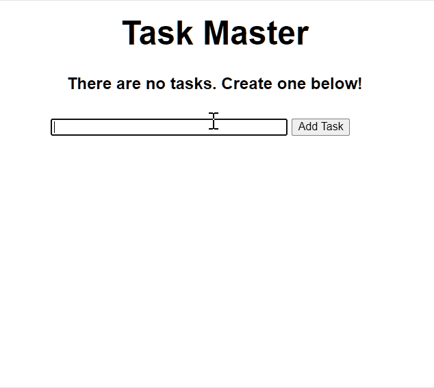

# Python Course: Learn Flask for Python

- **Author: Jake Rieger**
- **Course: [Learn Flask for Python ](https://www.youtube.com/watch?v=Z1RJmh_OqeA&list=WL&index=27&t=2s) on FreeCodeCamp**
- **Repo**: https://github.com/jakerieger/FlaskIntroduction/
- **Demo**
  

---

### Project Setup

- Make sure you install Python3 (Mac/Linux will have Python2 installed by default)
- Create a project and cd into the project
- Install virtualenv to the project

  ```
  pip3 install virtualenv
  ```

- Name your virtualenv as 'env' (convention)

  ```
  virtualenv env
  ```

- Activate your virtual environment

  ```
  source env/bin/activate
  ```

- Make sure that you are in the virtual environment and install flask &flask-sqlalchemy

  ```
  pip3 install flask flask-sqlalchemy
  ```

---

### File Setup

- Add 'app.py' file

  ```python
  from flask import Flask, render_template, url_for

  # Set up our application: __name__ to reference this file
  app = Flask(__name__)

  @app.route("/")
  def index():
      return render_template("index.html")

  if __name__ == "__main__":
      app.run(debug=True)
  ```

- Create templates/base.html, templates/index.html
- Create static\css\main.css
- Set up database in 'app.py' file

  ```python

  from flask_sqlalchemy import SQLAlchemy
  from datetime import datetime

  app.config['SQLALCHEMY_DATABASE_URI'] = 'sqlite:///test.db'

  # Initialise DB
  db = SQLAlchemy(app)

  # Create model
  class Todo(db.Model):
      id = db.Column(db.Integer, primary_key=True)
      # 200: 200 characters, nullable to prevent empty task
      content = db.Column(db.String(200), nullable=False)
      date_created = db.Column(db.DateTime, default=datetime.utcnow)

      def __repr__(self):
          return '<Task %r>' % self.id
  ```

- Go to your terminal (make sure that your virtual environment is activated)

  ```
  python3
  from app import db
  db.create_all()
  exit()
  ```

---

### CRUD Resources

##### POST/GET

- templates\index.html

```html
<table>
  <tr>
    <th>Task</th>
    <th>Added</th>
    <th>Actions</th>
  </tr>
  
  <tr>
    <td>{{ task.content }}</td>
    <td>{{ task.date_created.date() }}</td>
  </tr>
  
</table>
```

- app.py

```python
# How we create (post) and view (get) all entries
@app.route("/", methods=["POST", "GET"])
# methods[]: methods accepted by this route
def index():

    if request.method == "POST":
        # Create a new task from input
        task_content = request.form["content"]
        new_task = Todo(content=task_content)

        # Save it to DB and redirect
        try:
            db.session.add(new_task)
            db.session.commit()
            return redirect("/")
        # Error handling
        except:
            return "There was an issue adding your task"
    else:
        # Create a 'tasks' variable: Go to DB to query all the tasks created and order them by the created_time
        tasks = Todo.query.order_by(Todo.date_created).all()
        # Then pass 'tasks' variable to our template
        return render_template("index.html", tasks=tasks)
```

---

##### DELETE

- templates\index.html

```html
<a href="/delete/{{task.id}}">Delete</a>
```

- app.py

```python
# How we delete an entry by its ide
@app.route('/delete/<int:id>')
def delete(id):
    # Get the task by its id. If id doesn't exist, we have a 404.
    task_to_delete = Todo.query.get_or_404(id)

    try:
        db.session.delete(task_to_delete)
        db.session.commit()
        return redirect('/')
    except:
        return 'There was a problem deleting that task'
```

---

##### UPDATE

- templates\index.html

```html
<a href="/update/{{task.id}}">Update</a>
```

- templates\update.html [form to update]

```html
 
<title>Task Master</title>
 
<div class="content">
  <h1 style="text-align: center;">Update Task</h1>

  <div class="form">
    <form action="/update/{{task.id}}" method="POST">
      <!-- value="{{task.content}}": how we automatically populate the task content on update form -->
      <input type="text" name="content" id="content" value="{{task.content}}" />
      <input type="submit" value="Update" />
    </form>
  </div>
</div>

```

- app.py

```python
# How we update an entry by its id
@app.route('/update/<int:id>', methods=['GET', 'POST'])
def update(id):
    # Get the task by its id. If id doesn't exist, we have a 404.
    task_to_update = Todo.query.get_or_404(id)

    if request.method == 'POST':
        # Set the content of the task to the content on the form
        task_to_update.content = request.form['content']

        try:
            # We are just updating, so no need to create a new entry
            db.session.commit()
            return redirect('/')
        except:
            return 'There was an issue updating your task'

    else:
        return render_template('update.html', task=task_to_update)
```

---

©2020 Ellie Chen - All Rights Reserved.
